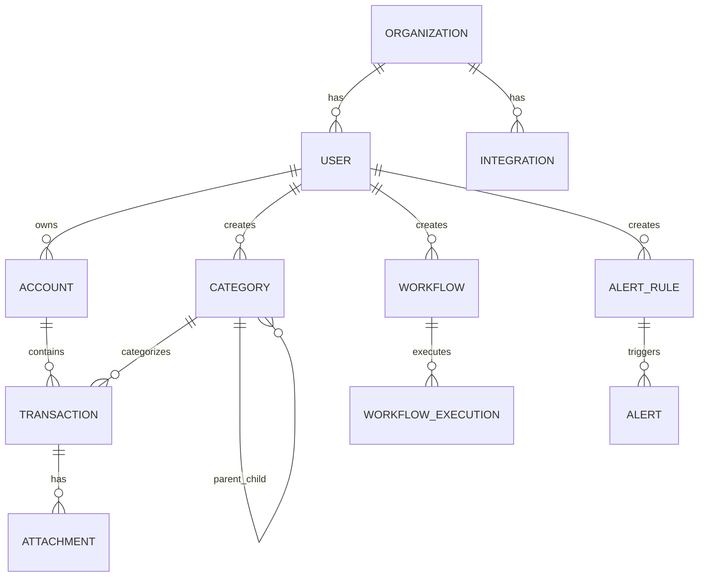

# DER - Diagrama Entidade Relacionamento
# Sistema Gestor Financeiro com Integração n8n

## 📋 Informações do Documento

- **Versão**: 1.0
- **Data**: 01/12/2025
- **Banco de Dados**: PostgreSQL 15+
- **Autor**: Bmad Master Agent
- **Status**: Draft para Validação

---

## 🏗️ Arquitetura do Banco de Dados

### Estrategia de Multi-Tenancy
- **Tenant Isolation**: Schema por organização
- **Row Level Security (RLS)**: Política de segurança em nível de linha
- **Shared Database**: Um banco, múltiplos tenants
- **Logical Separation**: Usar `tenant_id` em todas as tabelas

### Versionamento e Migrações
- **Ferramenta**: Prisma Migrate ou Knex.js
- **Estrutura**: Timestamped migrations
- **Rollback**: Migration reversa disponível
- **Seed Data**: Dados iniciais para desenvolvimento e testes

---

## 📊 Modelo Entidade-Relacionamento

### Entidades Principais

```
┌─────────────────────────────────────────────────────────────┐
│                        ORGANIZATION                         │
│ ┌─────────────┐ ┌─────────────┐ ┌─────────────────────────┐ │
│ │ id (PK)     │ │ name        │ │ settings               │ │
│ │ tenant_id   │ │ domain      │ │ billing_plan           │ │
│ │ created_at  │ │ status      │ │ preferences            │ │
│ └─────────────┘ └─────────────┘ └─────────────────────────┘ │
└─────────────────────────────────────────────────────────────┘
                              │
                              │
┌─────────────────────────────────────────────────────────────┐
│                           USER                             │
│ ┌─────────────┐ ┌─────────────┐ ┌─────────────────────────┐ │
│ │ id (PK)     │ │ email       │ │ avatar_url              │ │
│ │ tenant_id   │ │ first_name  │ │ last_login_at           │ │
│ │ org_id (FK) │ │ last_name   │ │ mfa_enabled            │ │
│ │ created_at  │ │ role        │ │ is_active               │ │
│ └─────────────┘ └─────────────┘ └─────────────────────────┘ │
└─────────────────────────────────────────────────────────────┘
                              │
                              │
┌─────────────────────────────────────────────────────────────┐
│                         ACCOUNT                            │
│ ┌─────────────┐ ┌─────────────┐ ┌─────────────────────────┐ │
│ │ id (PK)     │ │ name        │ │ balance                 │ │
│ │ tenant_id   │ │ type        │ │ currency                │ │
│ │ user_id (FK)│ │ bank_code   │ │ is_active               │ │
│ │ created_at  │ │ agency      │ │ account_number          │ │
│ └─────────────┘ └─────────────┘ └─────────────────────────┘ │
└─────────────────────────────────────────────────────────────┘
                              │
                              │
┌─────────────────────────────────────────────────────────────┐
│                        TRANSACTION                         │
│ ┌─────────────┐ ┌─────────────┐ ┌─────────────────────────┐ │
│ │ id (PK)     │ │ amount      │ │ description             │ │
│ │ tenant_id   │ │ type        │ │ date                    │ │
│ │ account_id(FK)│ status     │ │ source                  │ │
│ │ created_at  │ │ category_id │ │ external_id             │ │
│ └─────────────┘ └─────────────┘ └─────────────────────────┘ │
└─────────────────────────────────────────────────────────────┘
                              │
                              │
┌─────────────────────────────────────────────────────────────┐
│                         CATEGORY                           │
│ ┌─────────────┐ ┌─────────────┐ ┌─────────────────────────┐ │
│ │ id (PK)     │ │ name        │ │ color                   │ │
│ │ tenant_id   │ │ description │ │ icon                    │ │
│ │ user_id (FK)│ │ type        │ │ parent_id              │ │
│ │ created_at  │ │ is_system   │ │ is_active               │ │
│ └─────────────┘ └─────────────┘ └─────────────────────────┘ │
└─────────────────────────────────────────────────────────────┘
```

### Relacionamentos



---

## 📋 Especificação das Tabelas

### 1. ORGANIZATION (Organizações)

```sql
CREATE TABLE organization (
    id UUID PRIMARY KEY DEFAULT gen_random_uuid(),
    tenant_id VARCHAR(255) NOT NULL UNIQUE,
    name VARCHAR(255) NOT NULL,
    domain VARCHAR(255),
    status VARCHAR(50) NOT NULL DEFAULT 'ACTIVE',
    settings JSONB DEFAULT '{}',
    billing_plan VARCHAR(50) NOT NULL DEFAULT 'BASIC',
    billing_settings JSONB DEFAULT '{}',
    preferences JSONB DEFAULT '{}',
    created_at TIMESTAMP WITH TIME ZONE DEFAULT CURRENT_TIMESTAMP,
    updated_at TIMESTAMP WITH TIME ZONE DEFAULT CURRENT_TIMESTAMP,
    deleted_at TIMESTAMP WITH TIME ZONE
);

-- Índices
CREATE INDEX idx_organization_tenant_id ON organization(tenant_id);
CREATE INDEX idx_organization_status ON organization(status);

-- Constraints
ALTER TABLE organization ADD CONSTRAINT chk_billing_plan 
    CHECK (billing_plan IN ('BASIC', 'PROFESSIONAL', 'ENTERPRISE'));
ALTER TABLE organization ADD CONSTRAINT chk_status 
    CHECK (status IN ('ACTIVE', 'INACTIVE', 'SUSPENDED', 'TRIAL'));
```

### 2. USER (Usuários)

```sql
CREATE TABLE user (
    id UUID PRIMARY KEY DEFAULT gen_random_uuid(),
    tenant_id VARCHAR(255) NOT NULL,
    org_id UUID NOT NULL REFERENCES organization(id) ON DELETE CASCADE,
    email VARCHAR(255) NOT NULL,
    first_name VARCHAR(100) NOT NULL,
    last_name VARCHAR(100) NOT NULL,
    avatar_url TEXT,
    role VARCHAR(50) NOT NULL DEFAULT 'USER',
    password_hash VARCHAR(255) NOT NULL,
    salt VARCHAR(255),
    mfa_secret VARCHAR(255),
    mfa_enabled BOOLEAN DEFAULT FALSE,
    is_active BOOLEAN DEFAULT TRUE,
    email_verified BOOLEAN DEFAULT FALSE,
    last_login_at TIMESTAMP WITH TIME ZONE,
    login_attempts INTEGER DEFAULT 0,
    locked_until TIMESTAMP WITH TIME ZONE,
    created_at TIMESTAMP WITH TIME ZONE DEFAULT CURRENT_TIMESTAMP,
    updated_at TIMESTAMP WITH TIME ZONE DEFAULT CURRENT_TIMESTAMP,
    deleted_at TIMESTAMP WITH TIME ZONE,
    
    -- Constraints
    CONSTRAINT uq_user_email_tenant UNIQUE (email, tenant_id)
);

-- Índices
CREATE INDEX idx_user_tenant_id ON user(tenant_id);
CREATE INDEX idx_user_org_id ON user(org_id);
CREATE INDEX idx_user_email ON user(email);
CREATE INDEX idx_user_role ON user(role);

-- RLS
ALTER TABLE user ENABLE ROW LEVEL SECURITY;
CREATE POLICY user_isolation_policy ON user
    USING (tenant_id = current_setting('app.current_tenant')::text);

-- Constraints
ALTER TABLE user ADD CONSTRAINT chk_user_role 
    CHECK (role IN ('OWNER', 'ADMIN', 'MANAGER', 'USER', 'VIEWER'));
```

### 3. ACCOUNT (Contas Bancárias)

```sql
CREATE TABLE account (
    id UUID PRIMARY KEY DEFAULT gen_random_uuid(),
    tenant_id VARCHAR(255) NOT NULL,
    user_id UUID NOT NULL REFERENCES user(id) ON DELETE CASCADE,
    name VARCHAR(255) NOT NULL,
    type VARCHAR(50) NOT NULL,
    bank_code VARCHAR(10),
    bank_name VARCHAR(100),
    agency VARCHAR(20),
    account_number VARCHAR(50),
    balance DECIMAL(15,2) DEFAULT 0.00,
    currency VARCHAR(3) DEFAULT 'BRL',
    is_active BOOLEAN DEFAULT TRUE,
    is_main BOOLEAN DEFAULT FALSE,
    integration_settings JSONB DEFAULT '{}',
    last_sync_at TIMESTAMP WITH TIME ZONE,
    created_at TIMESTAMP WITH TIME ZONE DEFAULT CURRENT_TIMESTAMP,
    updated_at TIMESTAMP WITH TIME ZONE DEFAULT CURRENT_TIMESTAMP,
    deleted_at TIMESTAMP WITH TIME ZONE
);

-- Índices
CREATE INDEX idx_account_tenant_id ON account(tenant_id);
CREATE INDEX idx_account_user_id ON account(user_id);
CREATE INDEX idx_account_type ON account(type);
CREATE INDEX idx_account_is_main ON account(is_main);

-- RLS
ALTER TABLE account ENABLE ROW LEVEL SECURITY;
CREATE POLICY account_isolation_policy ON account
    USING (tenant_id = current_setting('app.current_tenant')::text);

-- Constraints
ALTER TABLE account ADD CONSTRAINT chk_account_type 
    CHECK (type IN ('BANK', 'CASH', 'CREDIT', 'INVESTMENT', 'SAVINGS'));
ALTER TABLE account ADD CONSTRAINT chk_balance_non_negative 
    CHECK (balance >= 0);
```

### 4. CATEGORY (Categorias)

```sql
CREATE TABLE category (
    id UUID PRIMARY KEY DEFAULT gen_random_uuid(),
    tenant_id VARCHAR(255) NOT NULL,
    user_id UUID NOT NULL REFERENCES user(id) ON DELETE CASCADE,
    name VARCHAR(255) NOT NULL,
    description TEXT,
    type VARCHAR(50) NOT NULL,
    color VARCHAR(7) DEFAULT '#666666',
    icon VARCHAR(100),
    parent_id UUID REFERENCES category(id) ON DELETE SET NULL,
    is_system BOOLEAN DEFAULT FALSE,
    is_active BOOLEAN DEFAULT TRUE,
    sort_order INTEGER DEFAULT 0,
    budget_limit DECIMAL(15,2),
    created_at TIMESTAMP WITH TIME ZONE DEFAULT CURRENT_TIMESTAMP,
    updated_at TIMESTAMP WITH TIME ZONE DEFAULT CURRENT_TIMESTAMP,
    deleted_at TIMESTAMP WITH TIME ZONE,
    
    -- Constraints
    CONSTRAINT uq_category_name_tenant UNIQUE (name, tenant_id)
);

-- Índices
CREATE INDEX idx_category_tenant_id ON category(tenant_id);
CREATE INDEX idx_category_user_id ON category(user_id);
CREATE INDEX idx_category_type ON category(type);
CREATE INDEX idx_category_parent_id ON category(parent_id);
CREATE INDEX idx_category_is_system ON category(is_system);

-- RLS
ALTER TABLE category ENABLE ROW LEVEL SECURITY;
CREATE POLICY category_isolation_policy ON category
    USING (tenant_id = current_setting('app.current_tenant')::text);

-- Constraints
ALTER TABLE category ADD CONSTRAINT chk_category_type 
    CHECK (type IN ('INCOME', 'EXPENSE', 'TRANSFER'));
```

### 5. TRANSACTION (Transações)

```sql
CREATE TABLE transaction (
    id UUID PRIMARY KEY DEFAULT gen_random_uuid(),
    tenant_id VARCHAR(255) NOT NULL,
    account_id UUID NOT NULL REFERENCES account(id) ON DELETE CASCADE,
    user_id UUID NOT NULL REFERENCES user(id) ON DELETE CASCADE,
    category_id UUID REFERENCES category(id) ON DELETE SET NULL,
    subcategory_id UUID,
    type VARCHAR(50) NOT NULL,
    amount DECIMAL(15,2) NOT NULL,
    currency VARCHAR(3) DEFAULT 'BRL',
    description TEXT NOT NULL,
    date DATE NOT NULL,
    status VARCHAR(50) NOT NULL DEFAULT 'COMPLETED',
    source VARCHAR(50) NOT NULL,
    external_id VARCHAR(255),
    external_data JSONB DEFAULT '{}',
    tags TEXT[] DEFAULT '{}',
    attachments TEXT[] DEFAULT '{}',
    is_recurring BOOLEAN DEFAULT FALSE,
    recurring_rule JSONB,
    created_at TIMESTAMP WITH TIME ZONE DEFAULT CURRENT_TIMESTAMP,
    updated_at TIMESTAMP WITH TIME ZONE DEFAULT CURRENT_TIMESTAMP,
    deleted_at TIMESTAMP WITH TIME ZONE,
    
    -- Constraints
    CONSTRAINT uq_transaction_external_id UNIQUE (external_id) DEFERRABLE INITIALLY DEFERRED
);

-- Índices
CREATE INDEX idx_transaction_tenant_id ON transaction(tenant_id);
CREATE INDEX idx_transaction_account_id ON transaction(account_id);
CREATE INDEX idx_transaction_user_id ON transaction(user_id);
CREATE INDEX idx_transaction_category_id ON transaction(category_id);
CREATE INDEX idx_transaction_type ON transaction(type);
CREATE INDEX idx_transaction_date ON transaction(date);
CREATE INDEX idx_transaction_status ON transaction(status);
CREATE INDEX idx_transaction_source ON transaction(source);
CREATE INDEX idx_transaction_amount ON transaction(amount);
CREATE INDEX idx_transaction_external_id ON transaction(external_id);

-- Particionamento por mês (para grandes volumes)
-- CREATE TABLE transaction_y2025m12 PARTITION OF transaction
-- FOR VALUES FROM ('2025-12-01') TO ('2026-01-01');

-- RLS
ALTER TABLE transaction ENABLE ROW LEVEL SECURITY;
CREATE POLICY transaction_isolation_policy ON transaction
    USING (tenant_id = current_setting('app.current_tenant')::text);

-- Constraints
ALTER TABLE transaction ADD CONSTRAINT chk_transaction_type 
    CHECK (type IN ('INCOME', 'EXPENSE', 'TRANSFER'));
ALTER TABLE transaction ADD CONSTRAINT chk_transaction_status 
    CHECK (status IN ('PENDING', 'COMPLETED', 'CANCELLED'));
ALTER TABLE transaction ADD CONSTRAINT chk_transaction_source 
    CHECK (source IN ('MANUAL', 'IMPORT', 'API', 'OCR', 'WEBHOOK', 'PIX'));
```

### 6. BANK_INTEGRATION (Integrações Bancárias)

```sql
CREATE TABLE bank_integration (
    id UUID PRIMARY KEY DEFAULT gen_random_uuid(),
    tenant_id VARCHAR(255) NOT NULL,
    user_id UUID NOT NULL REFERENCES user(id) ON DELETE CASCADE,
    account_id UUID REFERENCES account(id) ON DELETE CASCADE,
    bank_code VARCHAR(10) NOT NULL,
    bank_name VARCHAR(100) NOT NULL,
    integration_type VARCHAR(50) NOT NULL,
    credentials JSONB NOT NULL,
    access_token TEXT,
    refresh_token TEXT,
    token_expires_at TIMESTAMP WITH TIME ZONE,
    is_active BOOLEAN DEFAULT TRUE,
    last_sync_at TIMESTAMP WITH TIME ZONE,
    sync_settings JSONB DEFAULT '{}',
    created_at TIMESTAMP WITH TIME ZONE DEFAULT CURRENT_TIMESTAMP,
    updated_at TIMESTAMP WITH TIME ZONE DEFAULT CURRENT_TIMESTAMP,
    deleted_at TIMESTAMP WITH TIME ZONE
);

-- Índices
CREATE INDEX idx_bank_integration_tenant_id ON bank_integration(tenant_id);
CREATE INDEX idx_bank_integration_user_id ON bank_integration(user_id);
CREATE INDEX idx_bank_integration_account_id ON bank_integration(account_id);
CREATE INDEX idx_bank_integration_bank_code ON bank_integration(bank_code);
CREATE INDEX idx_bank_integration_type ON bank_integration(integration_type);

-- RLS
ALTER TABLE bank_integration ENABLE ROW LEVEL SECURITY;
CREATE POLICY bank_integration_isolation_policy ON bank_integration
    USING (tenant_id = current_setting('app.current_tenant')::text);

-- Constraints
ALTER TABLE bank_integration ADD CONSTRAINT chk_integration_type 
    CHECK (integration_type IN ('OPEN_BANKING', 'PIX', 'BOLETO', 'API'));
```

### 7. WORKFLOW (Workflows n8n)

```sql
CREATE TABLE workflow (
    id UUID PRIMARY KEY DEFAULT gen_random_uuid(),
    tenant_id VARCHAR(255) NOT NULL,
    user_id UUID NOT NULL REFERENCES user(id) ON DELETE CASCADE,
    name VARCHAR(255) NOT NULL,
    description TEXT,
    type VARCHAR(100) NOT NULL,
    category VARCHAR(100),
    n8n_workflow_id VARCHAR(255),
    n8n_webhook_url TEXT,
    settings JSONB DEFAULT '{}',
    trigger_config JSONB DEFAULT '{}',
    is_active BOOLEAN DEFAULT TRUE,
    is_public BOOLEAN DEFAULT FALSE,
    version INTEGER DEFAULT 1,
    tags TEXT[] DEFAULT '{}',
    created_at TIMESTAMP WITH TIME ZONE DEFAULT CURRENT_TIMESTAMP,
    updated_at TIMESTAMP WITH TIME ZONE DEFAULT CURRENT_TIMESTAMP,
    deleted_at TIMESTAMP WITH TIME ZONE
);

-- Índices
CREATE INDEX idx_workflow_tenant_id ON workflow(tenant_id);
CREATE INDEX idx_workflow_user_id ON workflow(user_id);
CREATE INDEX idx_workflow_type ON workflow(type);
CREATE INDEX idx_workflow_category ON workflow(category);
CREATE INDEX idx_workflow_is_active ON workflow(is_active);
CREATE INDEX idx_workflow_is_public ON workflow(is_public);

-- RLS
ALTER TABLE workflow ENABLE ROW LEVEL SECURITY;
CREATE POLICY workflow_isolation_policy ON workflow
    USING (tenant_id = current_setting('app.current_tenant')::text);
```

### 8. WORKFLOW_EXECUTION (Execuções de Workflow)

```sql
CREATE TABLE workflow_execution (
    id UUID PRIMARY KEY DEFAULT gen_random_uuid(),
    tenant_id VARCHAR(255) NOT NULL,
    workflow_id UUID NOT NULL REFERENCES workflow(id) ON DELETE CASCADE,
    transaction_id UUID REFERENCES transaction(id) ON DELETE SET NULL,
    status VARCHAR(50) NOT NULL DEFAULT 'PENDING',
    input_data JSONB,
    output_data JSONB,
    error_message TEXT,
    started_at TIMESTAMP WITH TIME ZONE DEFAULT CURRENT_TIMESTAMP,
    completed_at TIMESTAMP WITH TIME ZONE,
    execution_time_ms INTEGER,
    retry_count INTEGER DEFAULT 0
);

-- Índices
CREATE INDEX idx_workflow_execution_tenant_id ON workflow_execution(tenant_id);
CREATE INDEX idx_workflow_execution_workflow_id ON workflow_execution(workflow_id);
CREATE INDEX idx_workflow_execution_transaction_id ON workflow_execution(transaction_id);
CREATE INDEX idx_workflow_execution_status ON workflow_execution(status);
CREATE INDEX idx_workflow_execution_started_at ON workflow_execution(started_at);

-- RLS
ALTER TABLE workflow_execution ENABLE ROW LEVEL SECURITY;
CREATE POLICY workflow_execution_isolation_policy ON workflow_execution
    USING (tenant_id = current_setting('app.current_tenant')::text);

-- Constraints
ALTER TABLE workflow_execution ADD CONSTRAINT chk_execution_status 
    CHECK (status IN ('PENDING', 'RUNNING', 'SUCCESS', 'FAILED', 'CANCELLED'));
```

### 9. ALERT_RULE (Regras de Alerta)

```sql
CREATE TABLE alert_rule (
    id UUID PRIMARY KEY DEFAULT gen_random_uuid(),
    tenant_id VARCHAR(255) NOT NULL,
    user_id UUID NOT NULL REFERENCES user(id) ON DELETE CASCADE,
    name VARCHAR(255) NOT NULL,
    description TEXT,
    condition_type VARCHAR(100) NOT NULL,
    condition_config JSONB NOT NULL,
    notification_channels TEXT[] NOT NULL,
    is_active BOOLEAN DEFAULT TRUE,
    frequency VARCHAR(50) DEFAULT 'IMMEDIATE',
    last_triggered_at TIMESTAMP WITH TIME ZONE,
    trigger_count INTEGER DEFAULT 0,
    created_at TIMESTAMP WITH TIME ZONE DEFAULT CURRENT_TIMESTAMP,
    updated_at TIMESTAMP WITH TIME ZONE DEFAULT CURRENT_TIMESTAMP
);

-- Índices
CREATE INDEX idx_alert_rule_tenant_id ON alert_rule(tenant_id);
CREATE INDEX idx_alert_rule_user_id ON alert_rule(user_id);
CREATE INDEX idx_alert_rule_is_active ON alert_rule(is_active);
CREATE INDEX idx_alert_rule_condition_type ON alert_rule(condition_type);

-- RLS
ALTER TABLE alert_rule ENABLE ROW LEVEL SECURITY;
CREATE POLICY alert_rule_isolation_policy ON alert_rule
    USING (tenant_id = current_setting('app.current_tenant')::text);

-- Constraints
ALTER TABLE alert_rule ADD CONSTRAINT chk_frequency 
    CHECK (frequency IN ('IMMEDIATE', 'HOURLY', 'DAILY', 'WEEKLY'));
```

### 10. ALERT (Alertas)

```sql
CREATE TABLE alert (
    id UUID PRIMARY KEY DEFAULT gen_random_uuid(),
    tenant_id VARCHAR(255) NOT NULL,
    user_id UUID NOT NULL REFERENCES user(id) ON DELETE CASCADE,
    rule_id UUID REFERENCES alert_rule(id) ON DELETE CASCADE,
    transaction_id UUID REFERENCES transaction(id) ON DELETE SET NULL,
    title VARCHAR(255) NOT NULL,
    message TEXT NOT NULL,
    severity VARCHAR(50) NOT NULL DEFAULT 'INFO',
    status VARCHAR(50) NOT NULL DEFAULT 'UNREAD',
    metadata JSONB DEFAULT '{}',
    created_at TIMESTAMP WITH TIME ZONE DEFAULT CURRENT_TIMESTAMP,
    read_at TIMESTAMP WITH TIME ZONE,
    resolved_at TIMESTAMP WITH TIME ZONE
);

-- Índices
CREATE INDEX idx_alert_tenant_id ON alert(tenant_id);
CREATE INDEX idx_alert_user_id ON alert(user_id);
CREATE INDEX idx_alert_rule_id ON alert(rule_id);
CREATE INDEX idx_alert_transaction_id ON alert(transaction_id);
CREATE INDEX idx_alert_status ON alert(status);
CREATE INDEX idx_alert_severity ON alert(severity);
CREATE INDEX idx_alert_created_at ON alert(created_at);

-- RLS
ALTER TABLE alert ENABLE ROW LEVEL SECURITY;
CREATE POLICY alert_isolation_policy ON alert
    USING (tenant_id = current_setting('app.current_tenant')::text);

-- Constraints
ALTER TABLE alert ADD CONSTRAINT chk_severity 
    CHECK (severity IN ('INFO', 'WARNING', 'ERROR', 'CRITICAL'));
ALTER TABLE alert ADD CONSTRAINT chk_alert_status 
    CHECK (status IN ('UNREAD', 'READ', 'RESOLVED', 'IGNORED'));
```

### 11. ATTACHMENT (Anexos)

```sql
CREATE TABLE attachment (
    id UUID PRIMARY KEY DEFAULT gen_random_uuid(),
    tenant_id VARCHAR(255) NOT NULL,
    user_id UUID NOT NULL REFERENCES user(id) ON DELETE CASCADE,
    transaction_id UUID REFERENCES transaction(id) ON DELETE CASCADE,
    filename VARCHAR(255) NOT NULL,
    original_filename VARCHAR(255) NOT NULL,
    file_type VARCHAR(100) NOT NULL,
    file_size INTEGER NOT NULL,
    storage_path TEXT NOT NULL,
    storage_url TEXT NOT NULL,
    mime_type VARCHAR(100) NOT NULL,
    is_processed BOOLEAN DEFAULT FALSE,
    ocr_data JSONB,
    created_at TIMESTAMP WITH TIME ZONE DEFAULT CURRENT_TIMESTAMP
);

-- Índices
CREATE INDEX idx_attachment_tenant_id ON attachment(tenant_id);
CREATE INDEX idx_attachment_user_id ON attachment(user_id);
CREATE INDEX idx_attachment_transaction_id ON attachment(transaction_id);
CREATE INDEX idx_attachment_file_type ON attachment(file_type);
CREATE INDEX idx_attachment_is_processed ON attachment(is_processed);

-- RLS
ALTER TABLE attachment ENABLE ROW LEVEL SECURITY;
CREATE POLICY attachment_isolation_policy ON attachment
    USING (tenant_id = current_setting('app.current_tenant')::text);
```

### 12. AUDIT_LOG (Log de Auditoria)

```sql
CREATE TABLE audit_log (
    id UUID PRIMARY KEY DEFAULT gen_random_uuid(),
    tenant_id VARCHAR(255) NOT NULL,
    user_id UUID REFERENCES user(id) ON DELETE SET NULL,
    entity_type VARCHAR(100) NOT NULL,
    entity_id UUID NOT NULL,
    action VARCHAR(100) NOT NULL,
    old_values JSONB,
    new_values JSONB,
    ip_address INET,
    user_agent TEXT,
    metadata JSONB DEFAULT '{}',
    created_at TIMESTAMP WITH TIME ZONE DEFAULT CURRENT_TIMESTAMP
);

-- Índices
CREATE INDEX idx_audit_log_tenant_id ON audit_log(tenant_id);
CREATE INDEX idx_audit_log_user_id ON audit_log(user_id);
CREATE INDEX idx_audit_log_entity_type ON audit_log(entity_type);
CREATE INDEX idx_audit_log_entity_id ON audit_log(entity_id);
CREATE INDEX idx_audit_log_action ON audit_log(action);
CREATE INDEX idx_audit_log_created_at ON audit_log(created_at);

-- RLS
ALTER TABLE audit_log ENABLE ROW LEVEL SECURITY;
CREATE POLICY audit_log_isolation_policy ON audit_log
    USING (tenant_id = current_setting('app.current_tenant')::text);
```

---

## 🔐 Segurança e RLS (Row Level Security)

### Configuração de Tenant Isolation

```sql
-- Função para obter tenant atual
CREATE OR REPLACE FUNCTION get_current_tenant()
RETURNS TEXT AS $$
BEGIN
    RETURN COALESCE(
        current_setting('app.current_tenant', true),
        'anonymous'
    );
END;
$$ LANGUAGE plpgsql SECURITY DEFINER;

-- Política genérica de isolamento
CREATE POLICY tenant_isolation_policy ON organization
    USING (tenant_id = get_current_tenant());

-- Aplicar tenant context automaticamente
CREATE OR REPLACE FUNCTION set_tenant_context(tenant_id_param TEXT)
RETURNS VOID AS $$
BEGIN
    PERFORM set_config('app.current_tenant', tenant_id_param, true);
END;
$$ LANGUAGE plpgsql SECURITY DEFINER;
```

### Roles e Permissões

```sql
-- Roles do sistema
CREATE ROLE app_admin;
CREATE ROLE app_manager;
CREATE ROLE app_user;
CREATE ROLE app_readonly;

-- Permissões específicas
GRANT SELECT, INSERT, UPDATE, DELETE ON ALL TABLES IN SCHEMA public TO app_admin;
GRANT SELECT, INSERT, UPDATE ON ALL TABLES IN SCHEMA public TO app_manager;
GRANT SELECT, INSERT, UPDATE ON ALL TABLES IN SCHEMA public TO app_user;
GRANT SELECT ON ALL TABLES IN SCHEMA public TO app_readonly;

-- Permissões para sequences
GRANT USAGE, SELECT ON ALL SEQUENCES IN SCHEMA public TO app_admin;
GRANT USAGE, SELECT ON ALL SEQUENCES IN SCHEMA public TO app_manager;
GRANT USAGE, SELECT ON ALL SEQUENCES IN SCHEMA public TO app_user;
```

---

## ⚡ Performance e Otimização

### Índices Compostos

```sql
-- Índices para consultas frequentes
CREATE INDEX idx_transaction_tenant_date ON transaction(tenant_id, date);
CREATE INDEX idx_transaction_tenant_type_date ON transaction(tenant_id, type, date);
CREATE INDEX idx_transaction_account_date ON transaction(account_id, date DESC);
CREATE INDEX idx_category_tenant_type ON category(tenant_id, type);

-- Índices para agregações
CREATE INDEX idx_transaction_amount_tenant ON transaction(amount, tenant_id);
CREATE INDEX idx_alert_user_status ON alert(user_id, status);
```

### Particionamento

```sql
-- Particionamento de transações por mês (para volumes altos)
CREATE TABLE transaction_partitioned (
    LIKE transaction INCLUDING ALL
) PARTITION BY RANGE (date);

-- Criar partições mensais automaticamente
CREATE OR REPLACE FUNCTION create_monthly_partitions()
RETURNS VOID AS $$
DECLARE
    start_date DATE;
    end_date DATE;
    partition_name TEXT;
BEGIN
    -- Criar partições para os próximos 6 meses
    FOR i IN 0..5 LOOP
        start_date := date_trunc('month', CURRENT_DATE + (i || ' months')::INTERVAL);
        end_date := start_date + INTERVAL '1 month';
        partition_name := 'transaction_' || to_char(start_date, 'YYYY_MM');
        
        EXECUTE format('CREATE TABLE IF NOT EXISTS %I PARTITION OF transaction_partitioned
                       FOR VALUES FROM (%L) TO (%L)',
                      partition_name, start_date, end_date);
    END LOOP;
END;
$$ LANGUAGE plpgsql;
```

### Caching Strategy

```sql
-- Views materializadas para relatórios
CREATE MATERIALIZED VIEW mv_monthly_summary AS
SELECT 
    tenant_id,
    date_trunc('month', date) as month,
    type,
    COUNT(*) as transaction_count,
    SUM(amount) as total_amount,
    AVG(amount) as avg_amount
FROM transaction 
WHERE deleted_at IS NULL
GROUP BY tenant_id, date_trunc('month', date), type;

-- Índice na view materializada
CREATE INDEX idx_mv_monthly_summary_tenant_month ON mv_monthly_summary(tenant_id, month);

-- Refresh automático da view
CREATE OR REPLACE FUNCTION refresh_monthly_summary()
RETURNS VOID AS $$
BEGIN
    REFRESH MATERIALIZED VIEW CONCURRENTLY mv_monthly_summary;
END;
$$ LANGUAGE plpgsql;
```

---

## 🔄 Migrações e Versionamento

### Estrutura de Migrações

```sql
-- Tabela de controle de migrações
CREATE TABLE schema_migrations (
    version VARCHAR(255) PRIMARY KEY,
    applied_at TIMESTAMP WITH TIME ZONE DEFAULT CURRENT_TIMESTAMP
);

-- Exemplo de migração inicial
-- 20251201000001_initial_schema.sql
INSERT INTO schema_migrations (version) VALUES ('20251201000001');

-- Função para verificar status de migrações
CREATE OR REPLACE FUNCTION get_migration_status()
RETURNS TABLE (
    version TEXT,
    applied_at TIMESTAMP WITH TIME ZONE,
    pending BOOLEAN
) AS $$
BEGIN
    RETURN QUERY
    SELECT 
        m.version,
        m.applied_at,
        CASE WHEN m.applied_at IS NULL THEN true ELSE false END as pending
    FROM generate_series(
        (SELECT MIN(version::int) FROM schema_migrations),
        (SELECT MAX(version::int) FROM schema_migrations)
    ) as seq(version)
    LEFT JOIN schema_migrations ON seq.version::text = schema_migrations.version
    ORDER BY seq.version;
END;
$$ LANGUAGE plpgsql;
```

---

## 📊 Monitoramento e Manutenção

### Estatísticas de Tabelas

```sql
-- Análise de performance das tabelas
CREATE VIEW table_stats AS
SELECT 
    schemaname,
    tablename,
    n_tup_ins as inserts,
    n_tup_upd as updates,
    n_tup_del as deletes,
    n_live_tup as live_rows,
    n_dead_tup as dead_rows,
    last_vacuum,
    last_autovacuum,
    last_analyze,
    last_autoanalyze
FROM pg_stat_user_tables
ORDER BY n_live_tup DESC;

-- Análise de índices
CREATE VIEW index_stats AS
SELECT 
    schemaname,
    tablename,
    indexname,
    idx_scan as index_scans,
    idx_tup_read as tuples_read,
    idx_tup_fetch as tuples_fetched
FROM pg_stat_user_indexes
ORDER BY idx_scan DESC;
```

### Rotinas de Manutenção

```sql
-- Função para vacuum automático
CREATE OR REPLACE FUNCTION auto_vacuum_tables()
RETURNS VOID AS $$
BEGIN
    -- Vacuum em tabelas com muitos dead tuples
    PERFORM 
        schemaname || '.' || tablename
    FROM pg_stat_user_tables 
    WHERE n_dead_tup > 1000
    ORDER BY n_dead_tup DESC
    LIMIT 5;
    
    -- Executar VACUUM ANALYZE
    EXECUTE 'VACUUM ANALYZE';
END;
$$ LANGUAGE plpgsql;

-- Agendar vacuum semanal
SELECT cron.schedule('weekly-vacuum', '0 2 * * 0', 'SELECT auto_vacuum_tables();');
```

---

## 🎯 Recomendações de Implementação

### 1. Configuração Inicial
- Configurar PostgreSQL com optimizations específicas
- Implementar connection pooling (PgBouncer)
- Configurar WAL archiving para backup point-in-time

### 2. Segurança
- Ativar SSL/TLS em todas as conexões
- Configurar firewall para permitir apenas aplikasi server
- Implementar audit logging completo
- Rotação regular de senhas e tokens

### 3. Backup Strategy
- **Daily**: Backup full com pg_dump
- **Hourly**: WAL archiving contínuo
- **Retention**: 30 dias full backup, 7 dias WAL
- **Test**: Restauração mensal para validação

### 4. Monitoring
- **Database Metrics**: Conectios ativas, slow queries, locks
- **Application Metrics**: Query performance, connection pool usage
- **Alerting**: Thresholds para performance degradation

### 5. Scaling Strategy
- **Vertical**: Aumento de recursos do DB server
- **Horizontal**: Read replicas para queries de relatórios
- **Partitioning**: Particionamento por tenant ou tempo
- **Archiving**: Moving de dados antigos para cold storage

---

*Este DER fornece a base completa para implementação do banco de dados do Sistema Gestor Financeiro com Integração n8n, incluindo considerações de segurança, performance e escalabilidade.*