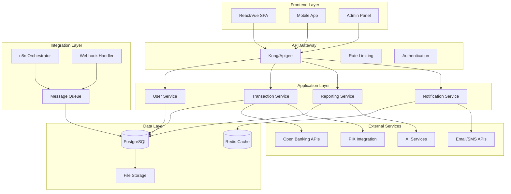

# PRD - Product Requirements Document
# Sistema Gestor Financeiro com Integração n8n

## 📋 Informações do Documento

- **Versão**: 1.0
- **Data**: 01/12/2025
- **Autor**: Bmad Master Agent
- **Status**: Draft para Validação

---

## 🎯 Product Vision e Objetivos

### Visão do Produto
O **Sistema Gestor Financeiro com Integração n8n** é uma plataforma SaaS que combina gestão financeira inteligente com automação robusta, oferecendo uma solução completa para empresas brasileiras automatizarem seus processos financeiros através de workflows visuais e integrações bancárias em tempo real.

### Missão
Democratizar o acesso à automação financeira empresarial, permitindo que empresas de todos os portes transformem dados financeiros em insights acionáveis através de IA e integração seamless com o ecossistema financeiro brasileiro.

### Objetivos Estratégicos
1. **Automatizar 80%+** das tarefas financeiras repetitivas
2. **Reduzir 60%+** do tempo gasto em processos manuais
3. **Aumentar 95%+** a precisão na categorização de transações
4. **Fornecer insights em tempo real** através de dashboards inteligentes
5. **Garantir compliance** com regulamentações brasileiras (LGPD, BACEN, SUSEP)

---

## 👥 Personas e User Stories

### Persona 1: João - Pequeno Empresário
**Contexto**: Dono de loja de vestuário com 15 funcionários, faturamento R$ 500k/mês
**Dor**: Dificuldade em acompanhar fluxo de caixa, gastos com fornecedores, inadimplência
**Objetivo**: Ter controle total da situação financeira diária

#### User Stories - João
```gherkin
Como proprietário de PME
Quero ver meu fluxo de caixa em tempo real
Para poder tomar decisões rápidas sobre compras e pagamentos

Como proprietário de PME
Quero receber alertas quando gastos aumentarem >20%
Para controlar gastos desnecessários

Como proprietário de PME
Quero categorização automática das transações
Para economizar tempo na contabilidade
```

### Persona 2: Maria - Consultora Financeira
**Contexto**: Consultora autônoma com 20 clientes (PMEs e profissionais), receita R$ 25k/mês
**Dor**: Processo manual de coleta e análise de dados, relatórios repetitivos para cada cliente
**Objetivo**: Entregar relatórios profissionais automaticamente

#### User Stories - Maria
```gherkin
Como consultora financeira
Quero gerar relatórios personalizados por cliente
Para apresentar resultados profissionais

Como consultora financeira
Quero dashboards multi-tenant por cliente
Para mostrar dados de forma separada e segura

Como consultora financeira
Quero automação de coleta de dados por cliente
Para reduzir trabalho manual repetitivo
```

### Persona 3: Carlos - Microempreendedor
**Contexto**: MEI desenvolvedor web, faturamento R$ 8k/mês
**Dor**: Falta de organização financeira, dificuldades com compliance fiscal
**Objetivo**: Simplificar gestão financeira sem complexidade

#### User Stories - Carlos
```gherkin
Como microempreendedor
Quero setup simples em 5 minutos
Para começar a usar rapidamente

Como microempreendedor
Quero categorização automática inteligente
Para manter organização sem esforço

Como microempreendedor
Quero alertas básicos de vencimentos
Para não esquecer obrigações fiscais
```

### Persona 4: Ana - Startup CEO
**Contexto**: CEO de startup com 50 funcionários, burn rate R$ 200k/mês
**Dor**: Crescimento rápido vs. processos manuais, previsões imprecisas
**Objetivo**: Preparar para próximo round de investimento

#### User Stories - Ana
```gherkin
Como CEO de startup
Quero previsões automáticas de caixa
Para planejar crescimento e investimentos

Como CEO de startup
Quero integração com ERP
Para ter visão unificada dos dados

Como CEO de startup
Quero análises de burn rate e runway
Para tomar decisões estratégicas
```

---

## 🏗️ Requisitos Funcionais

### Módulo 1: Autenticação e Gerenciamento de Usuários

#### FR-001: Sistema de Autenticação
- **Descrição**: Sistema de login seguro com suporte a MFA
- **Critérios de Aceitação**:
  - Login com email/senha
  - Recuperação de senha por email
  - Multi-factor authentication (SMS/TOTP)
  - OAuth2 com Google/LinkedIn
  - Session timeout automático (2h)
- **Prioridade**: Must Have
- **Story Points**: 8

#### FR-002: Gerenciamento de Perfis
- **Descrição**: CRUD completo de perfis de usuário
- **Critérios de Aceitação**:
  - Criar/editar perfil pessoal
  - Upload de foto do perfil
  - Configurações de notificação
  - Preferências de linguagem
- **Prioridade**: Must Have
- **Story Points**: 5

#### FR-003: Controle de Acesso (RBAC)
- **Descrição**: Sistema de roles e permissões
- **Critérios de Aceitação**:
  - Owner, Admin, Manager, User, Viewer roles
  - Permissões granuladas por módulo
  - Herança de permissões
  - Auditoria de acessos
- **Prioridade**: Must Have
- **Story Points**: 13

### Módulo 2: Dashboard e Visualização

#### FR-004: Dashboard Principal
- **Descrição**: Painel principal com visão geral da saúde financeira
- **Critérios de Aceitação**:
  - Cards com KPIs principais (receita, despesa, lucro, caixa)
  - Gráficos de linha para evolução temporal
  - Gráficos de pizza para distribuição de gastos
  - Alertas em destaque
  - Atualização em tempo real
- **Prioridade**: Must Have
- **Story Points**: 13

#### FR-005: Dashboard Customizável
- **Descrição**: Sistema de widgets arrastáveis
- **Critérios de Aceitação**:
  - Drag & drop de widgets
  - Salvamento de layouts
  - Widgets predefinidos (chart types)
  - Configuração de refresh intervals
- **Prioridade**: Should Have
- **Story Points**: 8

#### FR-006: Relatórios Executivos
- **Descrição**: Relatórios visuais profissionais
- **Critérios de Aceitação**:
  - Relatórios PDF gerados automaticamente
  - Templates visuais profissionais
  - Agendamento de envios
  - Branding personalizado
- **Prioridade**: Could Have
- **Story Points**: 13

### Módulo 3: Gestão de Transações

#### FR-007: Cadastro Manual de Transações
- **Descrição**: Formulário para entrada manual de transações
- **Critérios de Aceitação**:
  - Form com validação em tempo real
  - Upload de comprovantes
  - Categorização automática
  - Recorrência automática
- **Prioridade**: Must Have
- **Story Points**: 8

#### FR-008: Importação de Extratos
- **Descrição**: Upload e parsing de arquivos bancários
- **Critérios de Aceitação**:
  - Suporte OFX, QIF, CSV
  - Parsing automático de colunas
  - Mapeamento manual de campos
  - Validação de dados
- **Prioridade**: Must Have
- **Story Points**: 13

#### FR-009: Integração Bancária Open Banking
- **Descrição**: Sincronização automática com bancos
- **Critérios de Aceitação**:
  - Conectar com 7 principais bancos
  - Sync automático de extratos
  - Consulta de saldo em tempo real
  - Webhook para novas transações
- **Prioridade**: Must Have
- **Story Points**: 21

### Módulo 4: Categorização Inteligente

#### FR-010: Categorização Automática com IA
- **Descrição**: Uso de ML para categorizar transações
- **Critérios de Aceitação**:
  - API com GPT-4 para análise de texto
  - Aprendizado baseado em usuário
  - 95%+ accuracy esperada
  - Feedback loop para melhoria
- **Prioridade**: Must Have
- **Story Points**: 13

#### FR-011: Categorias Personalizadas
- **Descrição**: Sistema de categorização flexível
- **Critérios de Aceitação**:
  - Árvore hierárquica de categorias
  - Criação/edição de categorias
  - Regras automáticas de categorização
  - Bulk recategorização
- **Prioridade**: Should Have
- **Story Points**: 8

### Módulo 5: Automação PIX

#### FR-012: Geração de QR Codes PIX
- **Descrição**: Criação dinâmica de QR codes PIX
- **Critérios de Aceitação**:
  - Suporte a todos os tipos de chave PIX
  - Validação de payload EMV
  - Geração automática de CRC16
  - API para criação de pagamentos
- **Prioridade**: Must Have
- **Story Points**: 8

#### FR-013: Webhook PIX
- **Descrição**: Sistema de notificações PIX
- **Critérios de Aceitação**:
  - Recebimento de confirmações PIX
  - Validação de autenticidade
  - Busca por transação por ID
  - Logs de todas as operações
- **Prioridade**: Must Have
- **Story Points**: 5

### Módulo 6: Processamento de Documentos

#### FR-014: OCR de Recibos e Faturas
- **Descrição**: Extração de dados de documentos via AI
- **Critérios de Aceitação**:
  - Upload de fotos de recibos
  - Extração via OCR.space
  - Extração de: valor, data, estabelecimento
  - Categorização automática
- **Prioridade**: Must Have
- **Story Points**: 8

#### FR-015: Processamento de Faturas via Email
- **Descrição**: Automação de extração de faturas em PDF
- **Critérios de Aceitação**:
  - Monitoramento Gmail/Outlook
  - Extração de 25+ campos via AI
  - Integração com fornecedores conhecidos
  - Validação e deduplicação
- **Prioridade**: Must Have
- **Story Points**: 13

### Módulo 7: Alertas e Notificações

#### FR-016: Sistema de Alertas Inteligentes
- **Descrição**: Notificações automáticas baseadas em regras
- **Critérios de Aceitação**:
  - Alertas por email/SMS/Telegram
  - Regras personalizáveis
  - Thresholds configuráveis
  - Escalação de alertas
- **Prioridade**: Should Have
- **Story Points**: 8

#### FR-017: Monitoramento de Goals Financeiros
- **Descrição**: Acompanhamento de metas financeiras
- **Critérios de Aceitação**:
  - Definição de metas (receita, despesa, lucro)
  - Tracking de progress
  - Alertas de desvios
  - Previsões de alcance
- **Prioridade**: Could Have
- **Story Points**: 8

### Módulo 8: Integração n8n

#### FR-018: Workflows n8n Pré-configurados
- **Descrição**: 8 workflows principais do n8n
- **Critérios de Aceitação**:
  - Import/export de workflows
  - Triggers personalizados
  - Webhooks bidirecionais
  - Error handling e retry logic
- **Prioridade**: Must Have
- **Story Points**: 21

#### FR-019: Marketplace de Workflows
- **Descrição**: Catálogo de workflows reutilizáveis
- **Critérios de Aceitação**:
  - Biblioteca de workflows templates
  - Sistema de rating/reviews
  - Upload de workflows customizados
  - Versionamento de workflows
- **Prioridade**: Could Have
- **Story Points**: 13

### Módulo 9: Agente Financeiro IA

#### FR-020: Chat Interface
- **Descrição**: Interface de chat para consultas financeiras
- **Critérios de Aceitação**:
  - Chat em tempo real
  - Suporte Telegram/WhatsApp
  - Memoria persistente de conversas
  - Comandos por voz
- **Prioridade**: Should Have
- **Story Points**: 13

#### FR-021: Análise Preditiva
- **Descrição**: IA para previsões financeiras
- **Critérios de Aceitação**:
  - Previsão de fluxo de caixa (30-90 dias)
  - Detecção de anomalias
  - Sugestões de otimização
  - Análise de tendências
- **Prioridade**: Could Have
- **Story Points**: 21

---

## 🔒 Requisitos Não-Funcionais

### Performance

#### NF-001: Tempo de Resposta
- **Critério**: Páginas carregam em < 2 segundos
- **Métrica**: 95th percentile < 2s
- **Teste**: Load testing com 1000 concurrent users
- **Prioridade**: Must Have

#### NF-002: Throughput
- **Critério**: Processamento de 10.000 transações/dia
- **Métrica**: 116 transactions/minute sustained
- **Teste**: Stress testing com 50x normal load
- **Prioridade**: Must Have

#### NF-003: Disponibilidade
- **Critério**: Uptime de 99.9%
- **Métrica**: Máximo 8.76 horas downtime/ano
- **Teste**: Multi-region deployment testing
- **Prioridade**: Must Have

### Escalabilidade

#### NF-004: Auto-scaling
- **Critério**: Scale horizontal baseado em load
- **Métrica**: < 30s para scale up, < 2min para scale down
- **Teste**: Synthetic load generation
- **Prioridade**: Should Have

#### NF-005: Database Performance
- **Critério**: Queries complexas executam em < 500ms
- **Métrica**: 95th percentile < 500ms
- **Teste**: Database profiling e optimization
- **Prioridade**: Must Have

### Segurança

#### NF-006: Criptografia
- **Critério**: Dados em repouso com AES-256
- **Métrica**: Todas as tabelas com sensitive data encriptadas
- **Teste**: Security audit e penetration testing
- **Prioridade**: Must Have

#### NF-007: Autenticação
- **Critério**: MFA obrigatório para admin users
- **Métrica**: 100% compliance com policy
- **Teste**: Security testing e social engineering
- **Prioridade**: Must Have

#### NF-008: Auditoria
- **Critério**: Log de todas as operações financeiras
- **Métrica**: 100% das transactions auditadas
- **Teste**: Audit log review e tamper detection
- **Prioridade**: Must Have

### Compliance

#### NF-009: LGPD Compliance
- **Critério**: Compliance total com LGPD
- **Métrica**: Privacy impact assessment aprobado
- **Teste**: Legal review e DPO certification
- **Prioridade**: Must Have

#### NF-010: PCI DSS
- **Critério**: Level 1 PCI DSS compliance
- **Métrica**: QSA audit passed
- **Teste**: Annual PCI assessment
- **Prioridade**: Should Have

---

## 🏗️ Arquitetura do Sistema

### High-Level Architecture



### Technology Stack

#### Frontend
- **Framework**: React 18+ ou Vue 3+ com TypeScript
- **State Management**: Redux Toolkit ou Zustand
- **UI Library**: Material-UI v5 ou Tailwind CSS
- **Charts**: Chart.js 4+ ou D3.js
- **Testing**: Jest + React Testing Library

#### Backend
- **Runtime**: Node.js 18+ ou Python 3.11+
- **Framework**: Fastify (Node) ou FastAPI (Python)
- **Database**: PostgreSQL 15+ para dados primários
- **Cache**: Redis 7+ para sessões e cache
- **Queue**: BullMQ ou Celery para jobs async

#### Infrastructure
- **Containerization**: Docker + Docker Compose
- **Orchestration**: Kubernetes (production)
- **CI/CD**: GitHub Actions
- **Monitoring**: Prometheus + Grafana
- **Logging**: ELK Stack (Elasticsearch, Logstash, Kibana)

#### Integration Platform
- **n8n**: Versão 1.0+ self-hosted ou cloud
- **Workflows**: 15+ workflows pré-configurados
- **Connectors**: 50+ integrações nativas
- **Webhooks**: Suporte a incoming/outgoing webhooks

---

## 📊 Especificações de Dados

### Domain Model

#### User (Usuário)
```typescript
interface User {
  id: string;
  email: string;
  firstName: string;
  lastName: string;
  avatar?: string;
  role: 'OWNER' | 'ADMIN' | 'MANAGER' | 'USER' | 'VIEWER';
  isActive: boolean;
  mfaEnabled: boolean;
  lastLoginAt: Date;
  createdAt: Date;
  updatedAt: Date;
}
```

#### Account (Conta)
```typescript
interface Account {
  id: string;
  userId: string;
  organizationId?: string;
  name: string;
  type: 'BANK' | 'CASH' | 'CREDIT' | 'INVESTMENT';
  currency: 'BRL' | 'USD' | 'EUR';
  balance: number;
  isActive: boolean;
  bankIntegration?: BankIntegration;
  createdAt: Date;
  updatedAt: Date;
}
```

#### Transaction (Transação)
```typescript
interface Transaction {
  id: string;
  accountId: string;
  type: 'INCOME' | 'EXPENSE';
  amount: number;
  currency: string;
  description: string;
  categoryId?: string;
  subcategoryId?: string;
  tags: string[];
  date: Date;
  status: 'PENDING' | 'COMPLETED' | 'CANCELLED';
  source: 'MANUAL' | 'IMPORT' | 'API' | 'OCR' | 'WEBHOOK';
  externalId?: string;
  attachments: string[];
  createdAt: Date;
  updatedAt: Date;
}
```

#### Category (Categoria)
```typescript
interface Category {
  id: string;
  userId: string;
  name: string;
  description?: string;
  color: string;
  icon: string;
  type: 'INCOME' | 'EXPENSE' | 'TRANSFER';
  parentId?: string;
  isSystem: boolean;
  isActive: boolean;
  createdAt: Date;
  updatedAt: Date;
}
```

### API Specifications

#### Authentication Endpoints

```http
POST /api/v1/auth/login
Content-Type: application/json

{
  "email": "user@example.com",
  "password": "securePassword123",
  "mfaCode": "123456"
}

Response: 200 OK
{
  "accessToken": "eyJhbGciOiJIUzI1NiIs...",
  "refreshToken": "eyJhbGciOiJIUzI1NiIs...",
  "user": {
    "id": "uuid",
    "email": "user@example.com",
    "firstName": "João",
    "lastName": "Silva",
    "role": "USER"
  },
  "expiresIn": 3600
}
```

#### Transactions Endpoints

```http
GET /api/v1/transactions
Authorization: Bearer {accessToken}
Content-Type: application/json

Query Parameters:
- page: number (default: 1)
- limit: number (default: 50, max: 100)
- type: 'INCOME' | 'EXPENSE' | 'TRANSFER'
- categoryId: string
- startDate: ISO8601 date
- endDate: ISO8601 date
- search: string

Response: 200 OK
{
  "data": [
    {
      "id": "uuid",
      "type": "EXPENSE",
      "amount": 150.00,
      "description": "Almoço no restaurante",
      "category": {
        "id": "uuid",
        "name": "Alimentação",
        "color": "#FF6B6B"
      },
      "date": "2025-12-01T12:00:00Z",
      "status": "COMPLETED"
    }
  ],
  "pagination": {
    "page": 1,
    "limit": 50,
    "total": 150,
    "pages": 3
  }
}
```

---

## 🚀 Critérios de Aceitação por Release

### Release 1.0 (MVP - Mês 3)
**Funcionalidades Obrigatórias:**
- ✅ FR-001: Sistema de Autenticação completo
- ✅ FR-004: Dashboard Principal básico
- ✅ FR-007: Cadastro Manual de Transações
- ✅ FR-014: OCR de Recibos via mobile
- ✅ FR-018: 2 Workflows n8n básicos

**Critérios de Sucesso:**
- 5+ usuários beta utilizando o sistema
- 95%+ uptime durante beta
- < 2s tempo de carregamento médio
- 50+ transações processadas via OCR

### Release 2.0 (Core Features - Mês 6)
**Funcionalidades Obrigatórias:**
- ✅ FR-009: Open Banking Integration
- ✅ FR-010: Categorização Automática com IA
- ✅ FR-012: Geração PIX QR Codes
- ✅ FR-015: Processamento de Faturas via Email
- ✅ FR-020: Chat Interface básico

**Critérios de Sucesso:**
- 50+ usuários pagantes
- 100+ transações processadas diariamente
- 15+ workflows n8n operacionais
- 90%+ satisfação dos usuários

### Release 3.0 (Enterprise - Mês 9)
**Funcérios Obrigatórios:**
- ✅ FR-003: RBAC completo
- ✅ FR-005: Dashboard Customizável
- ✅ FR-017: Monitoramento de Goals
- ✅ FR-019: Marketplace de Workflows
- ✅ FR-021: Análise Preditiva

**Critérios de Sucesso:**
- 200+ usuários ativos
- R$ 1.000.000+ volume processado
- 5+ integrações enterprise
- 85%+ retenção de usuários

---

## 📈 Métricas de Sucesso

### Product Metrics
- **Adoption Rate**: 85%+ usuários ativos mensais
- **Engagement**: 15+ sessões por usuário/mês
- **Retention**: 90%+ retenção após 30 dias
- **NPS Score**: 70+ (promoters minus detractors)

### Technical Metrics
- **Performance**: < 2s page load time (95th percentile)
- **Reliability**: 99.9%+ uptime
- **Scalability**: 10.000+ transações/dia
- **Security**: Zero security incidents

### Business Metrics
- **Conversion**: 40%+ trial-to-paid conversion
- **Revenue**: R$ 156.000 MRR no mês 24
- **CAC**: R$ 150 custo de aquisição por cliente
- **LTV**: R$ 2.400 lifetime value médio

### User Satisfaction
- **Support Response**: < 24h para issues críticos
- **Feature Requests**: 90%+ implementados em roadmap
- **Bug Resolution**: < 72h para bugs críticos
- **User Training**: < 5min para setup inicial

---

## 🎯 Riscos e Mitigações

### Riscos Técnicos

#### Risco 1: Integração com Open Banking
- **Probabilidade**: Média
- **Impacto**: Alto
- **Mitigação**: Implementar gradual, começar com 2 bancos principais
- **Plano B**: Fallback para importação manual de extratos

#### Risco 2: Performance com Grande Volume
- **Probabilidade**: Baixa
- **Impacto**: Alto
- **Mitigação**: Load testing desde MVP, arquitetura escalável
- **Plano B**: Sharding de database, read replicas

### Riscos de Negócio

#### Risco 3: Competição de Grandes Players
- **Probabilidade**: Alta
- **Impacto**: Alto
- **Mitigação**: Foco em automação via n8n, diferenciais únicos
- **Plano B**: Pivot para SaaS B2B, marketplace de workflows

#### Risco 4: Mudanças Regulatórias
- **Probabilidade**: Média
- **Impacto**: Médio
- **Mitigação**: Monitoramento regulatório contínuo
- **Plano B**: Adaptação rápida de compliance

### Riscos Operacionais

#### Risco 5: Dependência do n8n
- **Probabilidade**: Baixa
- **Impacto**: Alto
- **Mitigação**: Conhecimento interno, documentação completa
- **Plano B**: Desenvolvimento de workflow engine próprio

---

## 📞 Próximos Passos

### Imediatos (Próximas 2 Semanas)
1. **Validar personas** com 10+ entrevistas estruturadas
2. **Criar protótipo navegável** do dashboard principal
3. **Definir architecture decisions** (React vs Vue, Node vs Python)
4. **Setup inicial** do ambiente de desenvolvimento

### Curto Prazo (Próximo Mês)
1. **Desenvolver MVP** com funcionalidades core
2. **Implementar primeiro workflow** n8n (OCR receipts)
3. **Setup monitoring** e observabilidade
4. **Iniciar recruitment** do time técnico

### Médio Prazo (Próximos 3 Meses)
1. **Launch closed beta** com 20 usuários
2. **Iteração rápida** baseada em feedback
3. **Implementação** de integrações bancárias
4. **Preparação** para launch público

---

*Documento baseado no briefing.md desenvolvido anteriormente e adaptado para requisitos técnicos específicos.*